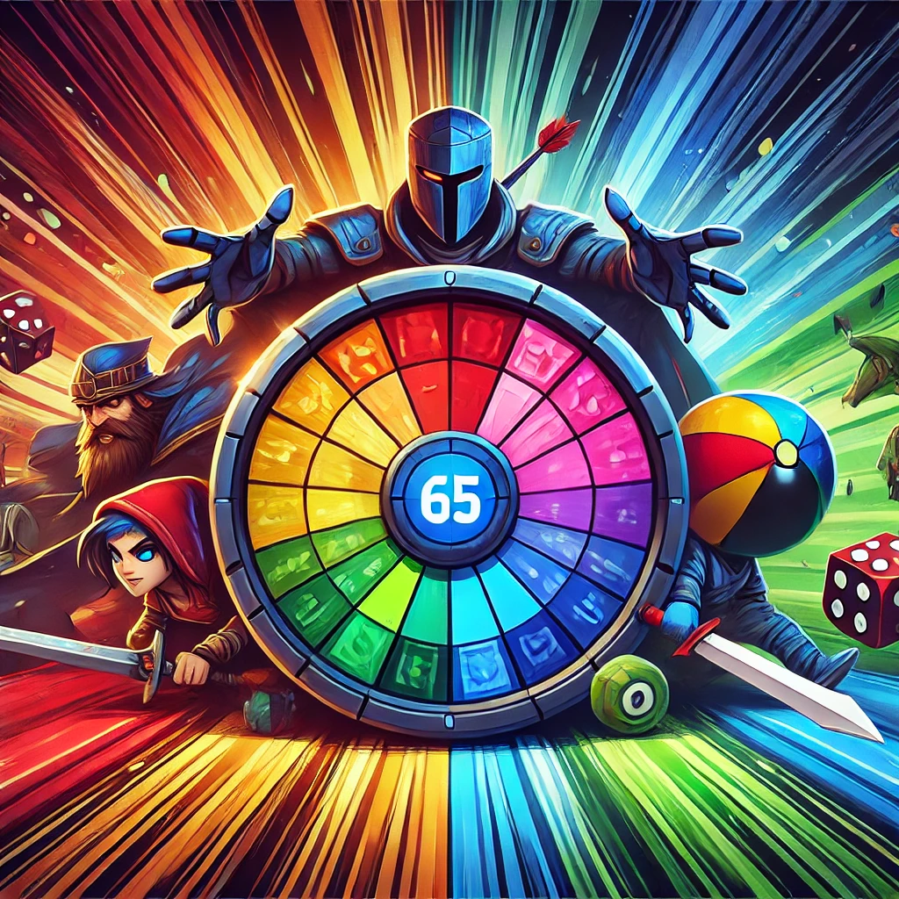

<div align="center">
  
</div>

<div align="center">
   
</div>

# Wheel of Games Bot 🎉🎮

## Description
Welcome to the "Wheel of Games" Bot! This bot helps you randomly choose games to play with your friends. The bot spins a virtual wheel and selects a game based on the number of players and a variety of other factors, ensuring a fun and fair game selection experience.

## Features
- 🎯 Choose games randomly based on player count.
- 🧩 Add, edit, or remove games from the server’s list.
- 🧮 Track play counts to prioritise less-played games.
- 🗓️ Automatically schedule events for the selected game.
- 🚫 Mark sessions as ignored to exclude them from future selections.
- 📊 List and filter games by player count and other details.

## Commands & Parameters 📋

### `/addgame`
Add a new game to the server's game list.

#### Parameters:
- `name`: **Required** – The name of the game.  
- `min_players`: **Required** – Minimum number of players supported.  
- `max_players`: **Required** – Maximum number of players supported.  
- `steam_link`: **Optional** – Steam store link for the game.  
- `banner_link`: **Optional** – URL to an image banner for the game.

#### Functionality
1. Adds the game to the server DB, using the current least-playcount as the `playcount_offset`.  
2. Prevents duplicate game entries (error returned if the game already exists).  
3. Shows a success message when the game is added.

### `/editgame`
Edit the details of an existing game on your server.

#### Parameters:

- `name`: Required – The name of the game you want to edit.
- `new_name`: Optional – The new name for the game.
- `min_players`: Optional – Update the minimum number of players.
- `max_players`: Optional – Update the maximum number of players.
- `steam_link`: Optional – Update or add the Steam link.
- `banner_link`: Optional – Update or add the banner image link.

#### Functionality

When you use `/editgame`, the bot fetches the game details from the database.

It shows a confirmation view where you can review your changes before applying them.

Once confirmed, the bot updates the game in the database and posts a public message summarizing the changes — including who made the edit.

The confirmation and edit summary are styled using Discord embeds, including the game’s banner image if available.

### `/choosegame`
Choose a game to play!

#### Parameters:
- `player_count`: **Required** – The number of players needed for the game. (e.g., 2, 4, 8)
- `ignore_least_played`: **Optional** – A boolean flag to choose games other than the least played games. (default: `False`)
- `event_day`: **Optional** - Override the day the gaming session will be scheduled for. By default it does *next wednesday*. Formatted dd/MMM (e.g. 13/Sep)
- `force_game`: **Optional** - Force a game to be chosen. Helpful if something goes wrong and you want to spin again. Or for rigging if you decided outside of the wheel and need to add a record that the game was chosen.

#### Functionality
1. The bot will spin a wheel with eligible games based on the player count.
2. You will be asked to confirm the selected game.
3. If the game isn't suitable, you can choose another by rejecting the current selection.
4. Once confirmed, an event will be scheduled for the game.

### `/availabilitypoll`
This command send a Poll in the channel for people to vote on their availability to game on a specific date.

This will create a poll that ends 1 week before the game date (or on the game date if 1 week before is in the past)

The max duration that a Poll can be is 31 days. So if you schedule further than that, the poll will end early.

#### Parameters:
- `event_day`: **Required** The day that the gaming session will happen. Format dd/MMM (e.g 13/Sep)

### `/wipegamememory`
Mark a game log as ignored. This means that this play record won't count toward "times played" for a game.

Games are (by default) selected by their least played count.

#### Parameters:
- `game_name`: **Required** – The name of the game to mark as ignored.
- `memory_date`: **Optional** – The specific date to mark as ignored (formatted as `YYYY-MM-DD`). If None provided, all records are marked as ignored for the specified game.

### `/listgames`
List all available games and their details.

#### Parameters:
- `player_count` **Optional** - The number of players to list games that support that count.

#### Output:
- Displays a list of games, their last played date, the number of times played.

---

## Installation to Run it

### Docker Run

```
docker run -d \
  --name wheel-of-games-bot \
  -e DISCORD_TOKEN="your-bot-token" \
  -v /path/to/your/config/folder:/app/config \
  denizenn:wheel-of-games-bot:latest
```

Replace "your-bot-token" with your actual Discord bot token. This will run the bot as a detached container named wheel-of-games-bot with the specified bot token passed as an environment variable.

Replace "path/to/your/config/folder" with the location you'd like the bot to store its database.

## Local Setup & Installation ⚙️  

### Prerequisites  
- Python 3.9+  
- Docker (if deploying in a container)  
- A Discord bot token  

### Local Setup  
1. Clone the repository:  
   <code>
   git clone https://github.com/your-repo/wheel-of-games-bot.git  
   cd wheel-of-games-bot
   </code>  
2. Install dependencies:  
   <code>
   pip install -r requirements.txt
   </code>  
3. Create a `.env` file:  
   <code>
   DISCORD_TOKEN=your_discord_bot_token
   </code>  
4. Run the bot:  
   <code>
   python bot.py
   </code>  

### Docker Deployment  
1. Build the Docker image:  
   <code>
   docker build -t wheel-of-games-bot .  
   </code>  
2. Run the container:  
   <code>
   docker run -e DISCORD_TOKEN=your_discord_bot_token wheel-of-games-bot  
   </code>  

---

## Contributing 🤝

1. Fork the repository.
2. Create a new branch (`git checkout -b feature/your-feature`).
3. Commit your changes (`git commit -am 'Add your feature'`).
4. Push to the branch (`git push origin feature/your-feature`).
5. Open a pull request.

---

## License 📄

This project is licensed under the AGPL-3.0 License – see the [LICENSE](LICENSE) file for details.

---

## Credits 🏆
- **Creator**: ChatGPT with tweaks by @joeShuff
- **Contributors**: Open for contributions!
