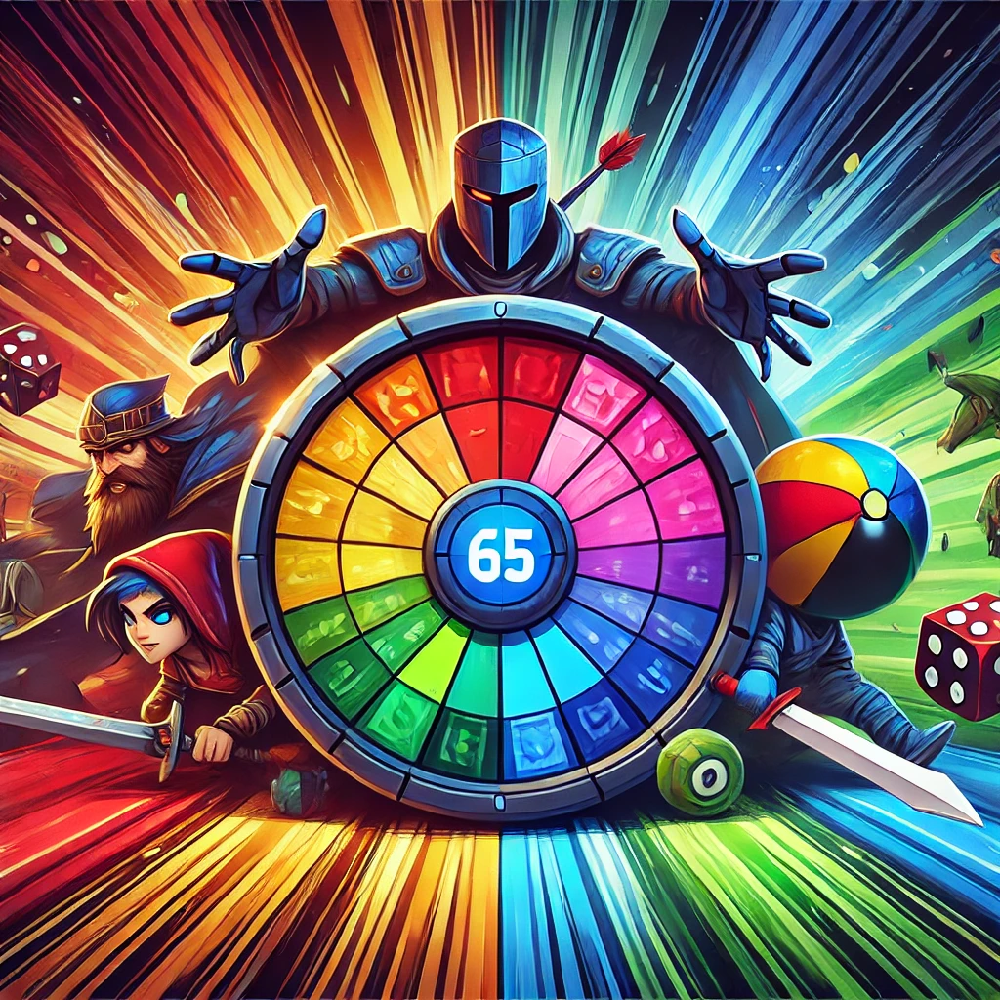

<div align="center">
  
</div>

<div align="center">
   
</div>

# Wheel of Games Bot 🎉🎮

## Description
A Discord bot that helps you randomly choose games to play with your friends. Spin the wheel, select based on player count and play history, and automatically schedule events.

> **Disclosure:** This project was created with AI assistance (Claude). See [Credits](#credits) for details.

## Features
- 🎡 Animated wheel spinner for fair game selection
- 🎯 Choose games by player count
- 🔁 Repeat the most recently played game
- 🧩 Add, edit, remove, and archive games
- 🧮 Track play counts to prioritise less-played games
- 🗓️ Automatically schedule Discord events
- 🚫 Mark sessions as ignored
- 📊 List and filter games

## Commands 📋

### Game Management
- **`/addgame`** – Add a new game with player count range and optional links.
- **`/editgame`** – Edit game details with confirmation.
- **`/removegame`** – Remove a game (requires approval from another user).
- **`/archivegame`** – Hide a game from selections while keeping play history.
- **`/unarchivegame`** – Restore an archived game.
- **`/listgames`** – List all games, optionally filtered by player count.

### Game Selection
- **`/choosegame`** – Spin the wheel and pick a game.
  - `player_count` (required) – Number of players
  - `ignore_least_played` (optional) – Pick from all eligible games instead of least-played
  - `event_day` (optional) – Schedule for a specific day (format: `dd/MMM`, e.g. `13/Sep`)
  - `force_game` (optional) – Force a specific game to be selected
  - `legacy_wheel` (optional) – Use the original wheel style
- **`/repeatgame`** – Repeat the most recently played game for the following week.
  - Shows the most recently played game, including its banner, before asking for confirmation
  - Creates the usual Discord event for the following week once confirmed
  - Repeated games are recorded in the play history but do not count towards the game's play count

### Tracking & Events
- **`/wipegamememory`** – Mark a game session as ignored (won't count toward play count).
  - `game_name` (required)
  - `memory_date` (optional) – Specific date to ignore, or all records if omitted
- **`/availabilitypoll`** – Create a poll for availability on a specific date.
  - `event_day` (required) – Poll for this date (format: `dd/MMM`)

---

## Installation 🚀

### Docker Compose (Recommended)

1. Create a `docker-compose.yaml` file with your configuration:
```yaml
services:
  wheel-of-games-bot:
    image: denizenn/wheel-of-games-bot:latest
    container_name: wheel-of-games-bot
    restart: unless-stopped
    environment:
      DISCORD_BOT_TOKEN: "your-bot-token"
      FONT_SCALE: "1.0"
    volumes:
      - /path/to/your/config/folder:/app/config
```

2. Run the bot:
```bash
docker-compose up -d
```

### Docker Run

```bash
docker run -d \
  --name wheel-of-games-bot \
  -e DISCORD_BOT_TOKEN="your-bot-token" \
  -e FONT_SCALE="1.0" \
  -v /path/to/your/config/folder:/app/config \
  denizenn/wheel-of-games-bot:latest
```

### Local Development

1. Clone the repository:
```bash
git clone https://github.com/your-repo/wheel-of-games-bot.git
cd wheel-of-games-bot
```

2. Install dependencies:
```bash
pip install -r requirements.txt
```

3. Set environment variables in a `.env` file:
```
DISCORD_BOT_TOKEN=your_discord_bot_token
FONT_SCALE=0.75
```

4. Run the bot:
```bash
python bot.py
```

---

## Configuration

### Environment Variables
- `DISCORD_BOT_TOKEN` – Your Discord bot token
- `FONT_SCALE` – Font size multiplier for wheel text (default: `1.0`, use `0.75` on macOS)

---

## Contributing 🤝

1. Fork the repository
2. Create a feature branch (`git checkout -b feature/your-feature`)
3. Commit your changes (`git commit -am 'Add your feature'`)
4. Push to the branch (`git push origin feature/your-feature`)
5. Open a pull request

---

## License 📄

This project is licensed under the AGPL-3.0 License – see the [LICENSE](LICENSE) file for details.

---

## Credits 🏆
- **Creator**: ChatGPT with tweaks by @joeShuff
- **Contributors**: Open for contributions!
